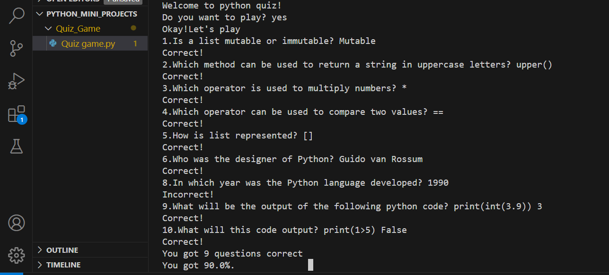

# Python Quiz

This is a simple Python quiz script that tests basic Python knowledge through a series of questions and provides feedback on the user's performance.

## Features:
- Asks the user if they want to play and starts the quiz if the answer is yes.
- Contains 10 questions covering various Python concepts.
- Tracks the user's score and provides feedback at the end of the quiz.

## Usage:
1. Run the script.
2. Answer the questions prompted.
3. Receive immediate feedback on your answers and final score.

## Output Screenshot:

